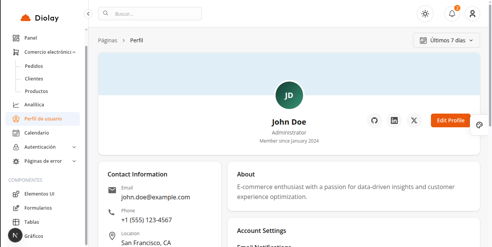
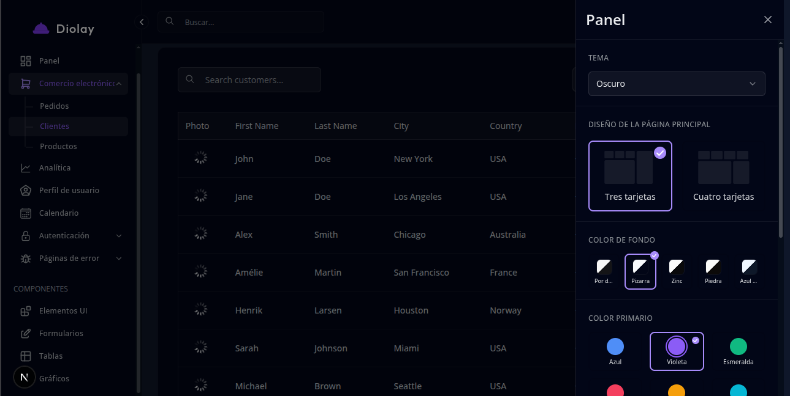

<div id="user-content-toc" >
  <ul align="center" style="list-style: none; padding: 0; margin: 0;">
    <summary>
      <h1 style="font-size: 3rem; margin-bottom: 10px;">
        ✨ Diolay ✨
      </h1>
    </summary>
  </ul>

  <p style="font-size: 1.2rem; margin-top: 10px;">
    <h6 style="text-align: center;">Efrain Chiri Nina</h6>
  </p>
  <p align="center">
    
  </p>
  
```bash
npm install
npm run dev
```

🎉 ¡Eso es todo! Ingresa a http://localhost:3000
 para explorar el panel de control.
 


## Estructura del Proyecto

```shell
├── src
│   ├── app                       # Next.js pages (App Router)
│   │   ├── [locale]              # Dynamic locale folder for i18n
│   │   │   ├── (auth)            # Auth & error pages
│   │   │   └── (protected)       # Protected pages (require auth)
│   │   └── api                   # API routes
│   ├── assets                    # Static assets
│   │   ├── icons                 # Icon components
│   │   └── images                # Image files
│   ├── components                # Main components folder
│   │   ├── auth                  # Authentication related components
│   │   ├── common                # Reusable components
│   │   ├── layout                # Layout components
│   │   └── views                 # Page-specific components
│   ├── hooks                     # Custom reusable hooks
│   │   └── auth                  # Authentication hooks
│   ├── i18n                      # Internationalization config
│   ├── queries                   # GraphQL queries
│   ├── services                  # Services utils
│   ├── store                     # Zustand stores
│   ├── styles                    # Themes and global styles
│   │   ├── themes                # Colors for themes
│   │   └── overrides             # Style overrides
│   ├── tests                     # Test files
│   │   ├── config                # Test configuration
│   │   ├── unit                  # Unit tests
│   │   └── utils                 # Test utilities
│   ├── utils                     # Utility functions
│   └── proxy.ts                  # Next.js proxy configuration
└── package.json                  # Project dependencies and scripts
```
